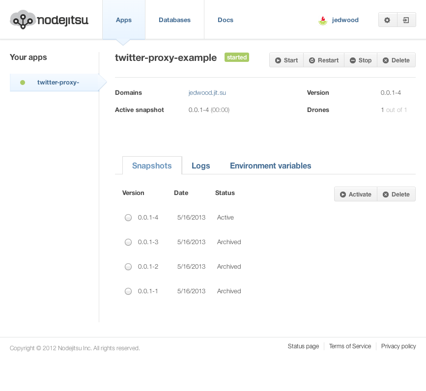
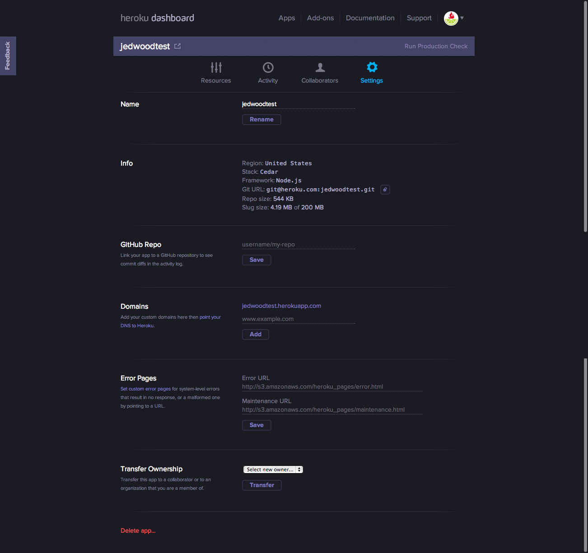
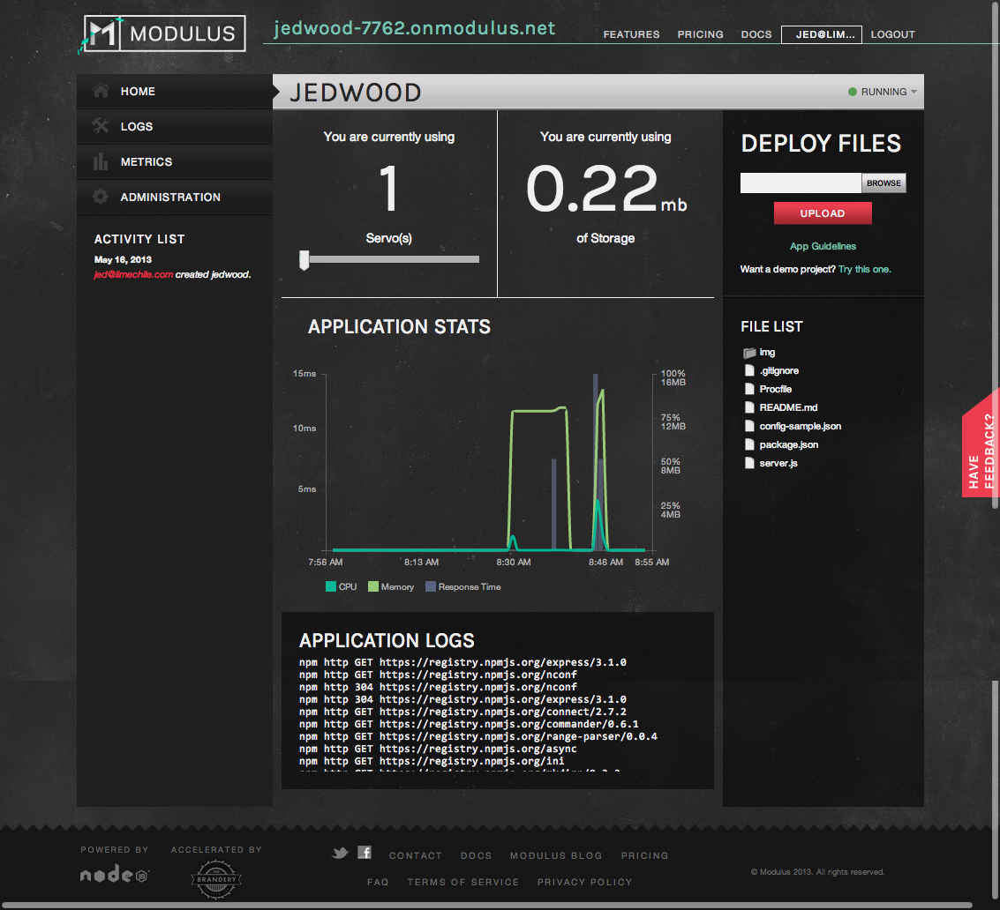
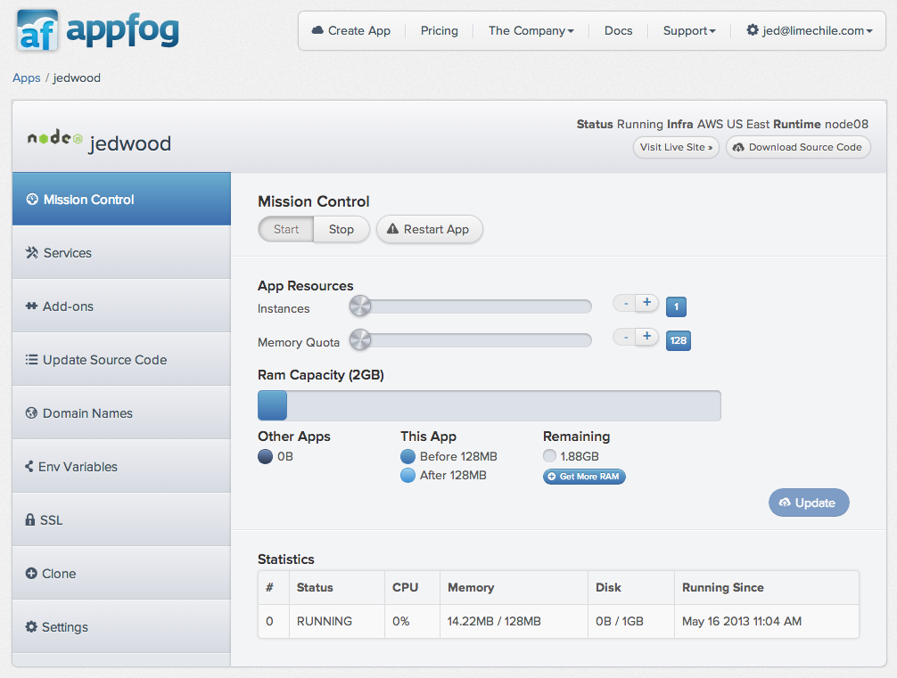
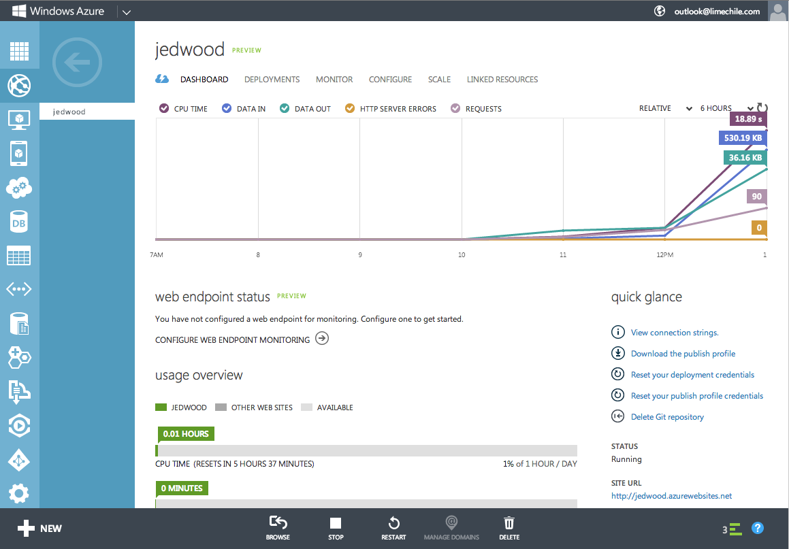
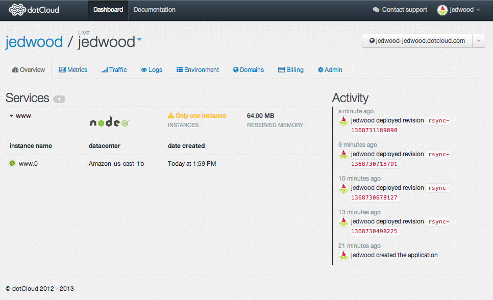

Node.js Hosting PaaS Providers
---

>A comparison as of of May 2013

Node.js may still be young relative to its counterparts, but when it comes to hosting there are a lot of options. In this post we'll take a look at several "Platform as a Service" providers.

I'm not including "Infrustructure as a Service" options like [AWS](http://aws.amazon.com) and [Joyent](http://joyent.com), although ironically I have much more personal experience with both of those than any provider on this list.

In this round, I'm primarily looking at two aspects: *deploying* and *configuring* environment variables. I'll also include some notes about getting started, some screenshots of dashboards, and other miscelaneous observations.

## The Setup

Here's the simple app we're going to be using as a test base.

        var express = require('express'),
            config   = require('nconf'),
            app     = express();

        config.argv().env().file({ file: '../config.json' });
        config.defaults({'PORT': 1337, SECRET: 'default secret.'});

        app.configure(function(){
          app.set('port', config.get('PORT'));
          app.use(express.bodyParser());
          app.use(express.methodOverride());
          app.use(app.router);
          app.use(express.logger('dev'));
          app.use(express.errorHandler());
        });

        app.get('/', function(req, res, next) {
          res.send({secret: config.get('SECRET')});
        });

        app.listen(app.get('port'), function(){
          console.log("Node.js Hosting Test listening on port " + config.get('PORT'));
          console.log("Running in ' + app.settings.env + " mode, Node version is: " + process.version);
        });

I'm using [nconf](https://github.com/flatiron/nconf) to elegantly handle the varying ways that we'll be specifying the port our app should listen to (sometimes required) and a dummy variable I'm calling `SECRET.` It will first look for arguments passed in to the `node` command, then environment variables, then it will try to load a `config.json` file one level up from the root, and finally fall back on some defaults we've defined right in the code. When I load the app, I'll be able to tell if our variables are being correctly pulled from one of those external sources. If it's not, the response I get back when I load the app will be `default secret`. I should also be able to see what port the app is listening on an the `NODE_ENV` it's using if I can access the logs from the startup of the app.

Finally, I'm setting `"engines": { "node": "v0.10.x" ...` in the `package.json` file to see how each provider reacts.

_And now in no particular order..._

## Nodejitsu
https://www.nodejitsu.com/

One of the original players and still purely a Node.js solution, Nodejitsu became an official partner of Joyent's back when Joyent [dropped their no.de service](http://joyent.com/no-de) (shame, it was such an awesome domain name). Nodejitsu no longer has a permanently free tier, but individual plans start at a paltry $3 a month and there's a 30-day free trial.

#### Configuring variables
According to the docs it doesn't matter what you set the listening port to, as long as it's either 80 or greater than 1024.

Setting our `SECRET` to override the default was straightforward, using the CLI you can list and set variables, much like several other providers on this list.

#### Deploying
Pushing your code to the Nodejitsu cloud is done via a custom command-line interface application (CLI), installed with npm. When you sign up you get dumped right into a github repository with instructions, but overall the setup process was pretty painless. You're prompted to select a subdomain, which is then automatically added to the `package.json` file. In the couple of tests I ran, deploying was really quick. It auto-increments the `version` property in the package.json file with each deploy, which doesn't bother me but might annoy some folks.

I only ran into two small hitches. The first was with versioning. In the message that gets spit out upon deploying, I was shown:

`info: jitsu v0.12.10-2, node v0.10.4`

and yet, I was told that `0.10.x` was not a supported value. Only by bumping down to `0.8.x` was I able to find success.

Second, I tried to change the `name` property in `package.json` and it then wouldn't let me deploy.

#### Misc Notes and Dashboard
I like that Nodejitsu is so Node.js centric. Any custom configuration is at least handled via the standard `package.json` file. You can even define custom `predeploy` and `postdeploy` hooks. My totally subjective response is that it felt very snappy to deploy and view logs.

## Heroku
https://www.heroku.com/

The 800 pound gorilla of the PaaS world, made insanely popular by their undying love from Ruby on Rails enthusiasts everywhere.

#### Configuring variables
Setting our `SECRET` to override the default was again using the CLI. No surprises there.

All apps run on port 5000, so you need to be listening for that.

Finally, you have to create a `Procfile` that has specifies `web: node server.js`. Not a big deal, but certainly a side effect of running on a PaaS that supports multiple languages.

#### Deploying
The Heroku "toolbelt" CLI is used to manage your account and applications, but deploying is done via git. You just add the endpoint they provide you as a `remote` in your git config. Because they're not exclusively focused on Node.js, I was pleasantly surprised to find that they already supported v 0.10.6!

My first deployment seemed to succeed, but tracking down the errors I received lead me to discover that I first needed to specify how many resources I wanted devoted to this app:

        heroku ps:scale web=1

After that, it was smooth sailing.

#### Misc Notes and Dashboard
I didn't try Heroku for my own projects until about 3 months ago, partly because I have a modest level of comfort in setting up my own servers, and partly because I just figured they treated node.js as an afterthought. But if you can get over their lack of WebSocket support and some [misleading marketing and stats](http://techcrunch.com/2013/02/14/heroku-admits-to-performance-degradation-over-the-past-3-years-after-criticism-from-rap-genius/), it's a pretty smooth experience.

They've also got a very polished and functional dashboard, with some handy features you won't find elsewhere like pointing to an S3-hosted file for 404 pages, and the ability to transfer ownership of a project to a different user.

## Modulus
http://modulus.io

The .io extension should tip you off that this is a relatively new service. Focused just on Node.js, they have built-in support for MongoDB and local file storage.

#### Configuring variables
Variables can be set either via the web interface or the CLI. I got stuck trying to create the `SECRET`. After a bit of trial and error, I discovered that you can't include spaces in the value! So `modulus secret` didn't work. Weird.

The app needs to listen on port 8080, "but we recommend using the PORT environment variable (process.env.PORT)."

#### Deploying
Deploying can be done via CLI, but you can also zip your whole project and upload it via their web interface, which is... interesting. I didn't have any problems deploying, but your entire project (except node_modules) gets bundled and uploaded every time, which makes it a much slower process than tools that use the "diff" capabilities of git or rsync.

As of writing, Modulus runs v 0.8.15 and ignores whatever you specify in package.json

#### Misc Notes and Dashboard
I'm cheering for these guys and hope they continue to improve. It's nice having the option of built-in MongoDB, and I like the upfront pricing.

## AppFog
http://appfog.com

The PaaS formerly known as PHP Fog. You can specify which cloud you want to run in, from several AWS regions, HP, an even Azure.

#### Configuring variables
Variables can be set either via the web interface or the CLI. No problems setting our `SECRET` variable.

The docs said I needed to listen to `process.env.VCAP_APP_PORT` for the port, but I just tried it with the default and it worked. The logs showed that it was listening on 57277.

#### Deploying
Also via the CLI. As of writing, AppFog runs v 0.8.14 and ignores whatever you specify in package.json

#### Misc Notes and Dashboard
The free plan seems pretty generous, giving you up to 8 instances across 2GB of RAM, split however you want. They also have options for built-in MongoDB.

## Windows Azure
http://windowsazure.com

Yep. Believe it.

#### Configuring variables
Variables can be set either via the web interface or the CLI. I experienced on weird behavior on the `SECRET` when I first set it up via the CLI; it was lowercased to `secret`. I had to use the web interface to correct it.

The app ran fine without making any changes to our configuration for ports, although the logs showed a pretty wacky value: `\\.\pipe\bea0dffc-de5b-47f4-8575-4d17c2175fd5`

#### Deploying
You might expect Microsoft to have all kinds of custom stuff here. While there are a few files that get dropped into you repo (name `azure_error` and `iisnode.yml`), the (optional) CLI is installed via npm and deployment is handled via git. Nice!

As of writing, Azure is running 0.8.2, and this value must be configured correctly in package.json.

#### Misc Notes and Dashboard
The account creation process was by far the most tedious of any listed here. It included SMS verification, a Windows Live account, and a separate git user account for deploying. But overall, the dashboard is pretty nice considering the huge scope of the Azure platform. They also support streaming log files. As far as I can tell, Heroku is the only other provider on this list to do so.

## dotCloud
http://dotcloud.com

Support for multiple languages. Like Nodejitsu they recently dropped their free tier, so a credit card is required to get started.

#### Configuring variables
Variables via the CLI or a `dotcloud.yml` file.

Port needs to be set to 8080.

#### Deploying
dotClouds CLI is written in Python and uses rsync to minimize the amount of data you need to upload on each deploy. In order to deploy, you need both a `supervisord.conf` and `dotcloud.yml` files, which is a minor nuisance.

As of writing, dotCloud runs 0.6.20. Ouch.

#### Misc Notes and Dashboard
I got burned early on by dotcloud when they made some breaking changes with little warning. I guess that's life in a beta world, but I haven't been anxious to run back.

### Engine Yard
- pick between nginx as front or straight to Node.js, which gives you option of WebSockets
- you configure more of the setup and environment
- respectes package.json, only up to 0.8.11
- when my first deploy failed, a chat window popped up with option for me to put in my phone number
- can't seem to find env vars, but with SSH can drop a config file on the server

#### OpenShift
- free preview no CC
- deploy via git
- MongoDB on board as a "cartridge"

#### CleverCloud (aka nodejs-cloud)
- Seems very early days. Sign-up and instructions not very clear
- Port set to 8080
- 0.10.3 and have Express and Socket.io pre-installed, but...
- don't even support environment variables. If you deploy with GIT, that's a must

